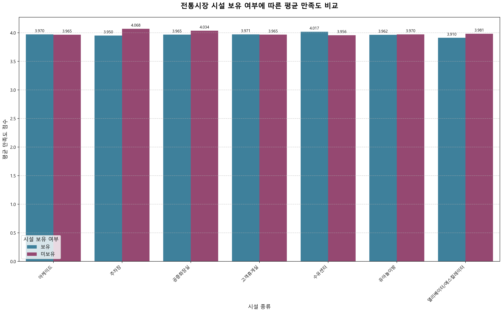
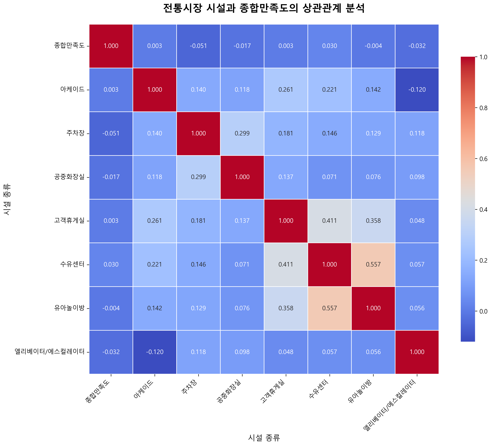

# 전국 전통시장 시설현황과 리뷰 데이터 분석

[](https://www.python.org/)
[](https://www.selenium.dev/)
[](https://pandas.pydata.org/)
[](LICENSE)

> **[과제안 4] 전국 전통시장 시설현황 + 시장별 리뷰 크롤링 분석**  
> 상명대학교 공공빅데이터분석 과제  
> 202210827 김정찬

**📍 프로젝트 규모**: 전국 1,388개 전통시장 | 990개 리뷰 데이터 분석 | 25개 시설 항목

---

## 📑 목차

- [프로젝트 개요](#-프로젝트-개요)
- [과제 목표](#-과제-목표)
- [데이터 수집 및 전처리](#-데이터-수집-및-전처리)
- [분석 방법 및 결과](#-분석-방법-및-결과)
- [분석 결과물](#-분석-결과물)
- [결론 및 제안](#-결론-및-제안)
- [프로젝트 구조](#-프로젝트-구조)
- [기술 스택](#️-기술-스택)
- [주요 시각화](#-주요-시각화)
- [사용 방법](#-사용-방법)
- [참고 자료](#-참고-자료)
- [프로젝트 의의](#-프로젝트-의의)
- [Contact](#-contact)

---

## 📋 프로젝트 개요

전국 전통시장의 **시설 현황**과 **온라인 리뷰 데이터**(네이버 지도, 카카오 맵)를 결합하여 **시장별 만족도**와 **시설 개선 필요 요인**을 분석하는 데이터 분석 프로젝트입니다. 공공데이터와 실제 고객 리뷰를 통해 전통시장 개선을 위한 시설 투자 우선순위를 제시합니다.

## 🎯 과제 목표

### 주요 목표
- 네이버 지도와 카카오 맵의 리뷰 데이터를 활용하여 고객들이 **전통시장**에서 실제로 중요하게 생각하는 시설 파악
- 시설들이 만족도에 미치는 영향을 별점을 통해 분석
- 공공데이터를 이용하여 실제 시설 보유 여부에 따른 각 전통시장의 만족도 차이 검증
- 전통시장 개선을 위한 **시설 투자 우선순위** 제시

### 분석 과제
1. ✅ **평점 상위 시장 분석**: 종합만족도 기준 시장 순위 산출
2. ✅ **시장 규모 대비 리뷰 평점 비교**: 점포 수와 만족도 간의 관계 분석
3. ✅ **키워드 분석**: 리뷰에서 시설 관련 키워드 빈도 분석 및 워드클라우드 생성
4. ✅ **지역별 만족도 차이**: 시도, 시군구별 시설 보유 현황 및 만족도 비교
5. ✅ **시설과 만족도 상관관계**: 25개 시설 유무와 종합만족도 간의 상관관계 분석

## 📊 데이터 수집 및 전처리

### 1. 데이터 소스

#### 공공데이터
- **소상공인시장진흥공단_전통시장현황** ([링크](https://www.data.go.kr/data/15052837/fileData.do))
- **소상공인시장진흥공단_전국 전통시장 현황** ([링크](https://www.data.go.kr/data/15052836/fileData.do))
- 총 **1,388개** 전통시장 데이터

#### 리뷰 데이터
- **네이버 지도** 별점 및 리뷰
- **카카오 맵** 별점 및 리뷰
- Selenium을 활용한 동적 크롤링

### 2. 주요 전처리 과정

#### 시설 데이터 매칭
공공데이터 두 파일을 매칭하여 다음 컬럼으로 구성된 `전통시장_매칭데이터` 생성:
- 기본 정보: 시장코드, 시장명, 지번주소, 도로명주소, 시도, 시군구, 시장개설주기, 점포수, 개설연도, 취급품목
- 시설 정보 (25개): 아케이드, 엘리베이터/에스컬레이터, 고객지원센터, 스프링쿨러, 화재감지기, 유아놀이방, 종합콜센터, 고객휴게실, 수유센터, 물품보관함, 자전거보관함, 체육시설, 간이도서관, 쇼핑카트, 외국인안내센터, 고객동선통로, 방송센터, 문화교실, 공동물류창고, 시장전용고객주차장, 교육장, 회의실, 자동심장충격기, 공중화장실, 주차장
- 위치 정보: 위도, 경도, 전화번호

#### 데이터 정제 문제 해결
1. **결측값 처리**: 도로명 주소와 지번 주소 상호 보완
2. **지역명 표준화**: `강원특별자치도` → `강원도` 등 통일
   ```python
   address = address.replace('강원특별자치도', '강원도')
   ```
3. **중복 시장명 처리**: `중앙시장`, `신흥시장` 등 동명 시장 존재
   - 도로명/지번 주소 비교를 통한 정확한 매칭
4. **특수문자 제거**: 괄호, 공백 등 정리

#### 리뷰 데이터 수집 (Selenium 동적 크롤링)

**크롤링 전략**
- 검색 키워드: `시군구 + 시장명` (정확도 향상)
  - 초기 시도: `시장명`만 사용 → 원하지 않는 장소 검색 문제 발생
  - 개선: `시군구 + 시장명` 조합으로 정확도 향상
- 수집 항목: 별점, 리뷰 텍스트
- 결과 파일: `review_result_test.csv`

**데이터 처리 주의사항**
1. **시장명 표준화**: 서울남대문시장 vs 남대문시장 등 다양한 표현 통일
2. **크롤링 실패 처리**: 리뷰가 없는 시장은 결측값으로 처리
3. **요청 차단 회피**: `time.sleep()` 사용하여 안정적인 크롤링
4. **동적 콘텐츠 대응**: Selenium을 활용하여 JavaScript 렌더링 처리

**크롤링 결과**
- 별점 데이터 보유 시장: **990개** (전체 1,388개 중 71.3%)

#### 최종 데이터 통합
- 시설 데이터와 리뷰 데이터 LEFT JOIN
- Y/N 형식을 1/0으로 변환
- 종합만족도: 네이버 + 카카오 별점 평균
- 최종 파일: `전통시장_최종전처리데이터`

## 🔍 분석 방법 및 결과

### 1. 리뷰 키워드 분석

LLM을 활용하여 25개 주요 시설에 대한 포괄적인 키워드 그룹을 정의하고, 리뷰 데이터에서 각 시설 관련 키워드 출현 빈도를 분석했습니다.

#### 고객이 중요하게 생각하는 시설 TOP 10
1. **주차장** ⭐ (압도적 1위)
2. **시장전용고객주차장** ⭐
3. 아케이드
4. 공중화장실
5. 고객휴게실
6. 고객동선통로
7. 종합콜센터
8. 유아놀이방
9. 엘리베이터/에스컬레이터
10. 문화교실

> **주차 편의성**이 전통시장 방문 시 가장 중요한 요소로 나타났습니다.

### 2. 시설 보유 현황 분석

별점이 있는 990개 시장의 시설 보유율:

#### 높은 보유율 시설 (70% 이상)
- 공중화장실
- 화재감지기
- 방송센터
- 회의실
- 시장전용고객주차장
- 주차장
- 고객동선통로
- 고객지원센터
- 교육장
- 아케이드

### 3. 시설과 만족도 상관관계 분석

히트맵을 통한 상관관계 분석 결과, 압도적으로 큰 상관관계를 보이는 시설은 없었으나, 다음 시설들이 미세하게 양의 상관관계를 보였습니다:

#### 만족도에 영향을 주는 시설 TOP 10
1. 수유센터
2. 문화교실
3. 종합콜센터
4. 자전거보관함
5. 체육시설
6. 자동심장충격기
7. 물품보관함
8. 방송센터
9. 아케이드
10. 화재감지기

> ⚠️ **주의**: 상관관계는 인과관계와 다르며, 해당 시설이 만족도에 직접적인 영향을 미친다고 단정할 수 없습니다.

### 4. 추가 분석

#### 시장 규모와 만족도 관계
- 점포 수(시장 규모)와 리뷰 평점 간의 관계 분석
- 총 시설 개수와 종합만족도 간의 상관관계 분석
- **결과**: 시설 개수와 만족도 간의 명확한 비례 관계가 나타나지 않음

#### 키워드 분석
- LLM을 활용한 25개 시설별 포괄적 키워드 그룹 정의
- 리뷰 텍스트에서 시설 관련 키워드 출현 빈도 분석
- **시각화**: 워드클라우드, 막대 그래프로 시설별 언급 빈도 표현

#### 지역별 분석
- 시도, 시군구별 시설 보유 현황 분석
- 990개 시장의 시설 보유율 비교

### 5. 주요 발견 사항

- 시설 개수와 만족도 간의 명확한 비례 관계가 나타나지 않음
- 공공데이터의 시설 유무 정보가 실제와 다른 경우 존재
- 리뷰 수가 적은 시장의 경우 소수 평가로 인한 편향 발생
  - 예: 1명이 5.0 평가 → 만점으로 표시
  - 예: 다수 평가 중 1명의 최하점이 전체 별점을 급격히 하락

## 📊 분석 결과물

### 1. 평점 상위 시장 순위
- 종합만족도(네이버 + 카카오 평균) 기준 상위 시장 도출
- 990개 시장 중 별점 데이터 분석

### 2. 시장 규모 대비 리뷰 평점 비교
- 점포 수(시장 규모)와 종합만족도 간의 관계 분석
- 총 시설 개수와 만족도 간의 상관관계 분석

### 3. 키워드 분석 워드클라우드
- 25개 시설별 리뷰 키워드 출현 빈도 분석
- 막대 그래프 및 워드클라우드로 시각화
- **주차장** 관련 키워드가 압도적 1위

### 4. 시설과 만족도 상관관계 히트맵
- 25개 시설 유무와 종합만족도 간의 상관계수 산출
- 히트맵을 통한 시각화
- **수유센터**, **문화교실** 등이 상대적으로 높은 상관관계

### 5. 지역별 만족도 분석
- 시도, 시군구별 시설 보유율 분석
- 990개 시장의 시설별 보유 비율 도출

## 💡 결론 및 제안

### 분석 결과 요약

1. **리뷰 분석**에서는 **주차장** 관련 시설이 압도적으로 중요
2. **상관관계 분석**에서는 **수유센터**, **문화교실** 등 가족 편의시설이 높은 상관관계
3. 두 분석 결과가 완전히 일치하지는 않으나, 고객 니즈의 다양한 측면을 보여줌

### 시설 투자 우선순위 제안

#### 1순위: 주차 편의시설
- **주차장** 및 **시장전용고객주차장** 확충
- 현재 16%의 시장이 주차공간 미보유
- 리뷰에서 압도적으로 언급되는 핵심 니즈

#### 2순위: 가족 편의시설
- **수유센터** (현재 보유율 20%)
- **문화교실** (현재 보유율 28%)
- 가족 단위 방문객을 위한 필수 시설

#### 3순위: 기타 편의시설
- 단계적 확대를 통한 종합적 만족도 향상

### 프로젝트 한계점

- 공공데이터의 시설 정보가 실제와 불일치하는 경우 존재
- 리뷰 수가 적은 시장의 평가 편향 (1명이 5.0 평가 vs 다수 평가)
- 상관관계 분석의 인과관계 해석 제한

## 📁 프로젝트 구조

```
Traditional-Market-Infrastructure-Review-Analysis/
├── data/                          # 데이터 파일
│   ├── 소상공인시장진흥공단_전통시장현황_20240719.csv  # 원본: 시설 정보
│   ├── 전국전통시장표준데이터.csv                        # 원본: 기본 정보
│   ├── 전통시장_매칭데이터.csv                          # 전처리: 두 데이터 매칭
│   ├── 전통시장_최종매칭데이터.csv                      # 전처리: 최종 시설 데이터
│   ├── 전통시장_최종합병데이터.csv                      # 최종: 시설+리뷰 통합 데이터
│   ├── review_result_kakao.csv                         # 크롤링: 카카오 맵 리뷰
│   ├── review_result_naver.csv                         # 크롤링: 네이버 지도 리뷰
│   ├── review_result_test.csv                          # 크롤링: 통합 리뷰
│   └── review_result.csv                               # 크롤링: 최종 리뷰
├── scripts/                       # Python 스크립트
│   ├── pbl_crawling_kakao.py     # 카카오 맵 크롤링 (Selenium)
│   ├── pbl_crawling_naver.py     # 네이버 지도 크롤링 (Selenium)
│   ├── pbl_crawling.py           # 통합 크롤링 스크립트
│   ├── merge_markets.py          # 데이터 매칭 및 병합
│   ├── smart_merge.py            # 스마트 데이터 병합
│   ├── review_keywords.py        # 리뷰 키워드 분석
│   ├── analysis.py               # 상관관계 분석
│   ├── analyze_matching_issue.py # 매칭 문제 분석
│   ├── verify_data.py            # 데이터 검증
│   └── ...
├── notebooks/                     # Jupyter 노트북
│   ├── 1_TraditionalMarkets_Preprocessing.ipynb  # 데이터 전처리
│   ├── 202210827.ipynb                           # 최종 분석 노트북
│   ├── last_analyze.ipynb                        # 최종 분석
│   ├── market_merge.ipynb                        # 데이터 병합 테스트
│   └── 과제4.ipynb                                # 과제 작업
├── results/                       # 분석 결과 이미지
│   ├── correlation_heatmap.png                   # 시설-만족도 상관관계 히트맵
│   └── facility_impact_analysis.png              # 시설별 영향 분석 그래프
├── reports/                       # 프로젝트 보고서
│   └── 공공빅데이터분석_과제.pdf                   # 최종 제출 보고서
├── submission_midterm/            # 중간 제출물
└── README.md
```

### 데이터 처리 파이프라인

```
[공공데이터 다운로드]
    ↓
[전통시장_매칭데이터.csv] ← 두 공공데이터 매칭 (1,388개 시장)
    ↓
[웹 크롤링] → review_result_kakao.csv, review_result_naver.csv
    ↓
[전통시장_최종합병데이터.csv] ← LEFT JOIN (990개 시장, 별점 보유)
    ↓
[분석 및 시각화] → correlation_heatmap.png, facility_impact_analysis.png
    ↓
[최종 보고서]
```

## 🛠️ 기술 스택

### 핵심 라이브러리
```python
import pandas as pd
import numpy as np
import requests
from bs4 import BeautifulSoup
from selenium import webdriver
from selenium.webdriver.common.by import By
from selenium.webdriver.support.ui import WebDriverWait
from selenium.webdriver.support import expected_conditions as EC
import time
import matplotlib.pyplot as plt
import seaborn as sns
```

### 기술 상세
- **Python 3.x**
- **웹 크롤링**
  - `Selenium`: 네이버 지도, 카카오 맵 동적 크롤링 (JavaScript 렌더링 처리)
  - `BeautifulSoup`: HTML 파싱 (필요시)
  - `requests`: HTTP 요청
- **데이터 처리**
  - `Pandas`: 데이터 전처리, 매칭, 병합
  - `NumPy`: 수치 연산
- **데이터 분석**
  - 상관관계 분석 (Correlation Analysis)
  - 키워드 빈도 분석
  - 통계 분석
- **시각화**
  - `Matplotlib`: 기본 그래프 생성
  - `Seaborn`: 히트맵, 통계 시각화
  - 워드클라우드 생성
- **자연어 처리**
  - LLM: 시설별 키워드 그룹 정의
  - 텍스트 전처리 및 키워드 추출

## 📈 주요 시각화

### 시설별 리뷰 언급 빈도


### 시설과 만족도 상관관계 히트맵


## 🚀 사용 방법

### 1. 환경 설정
```bash
# 필요한 라이브러리 설치
pip install pandas numpy selenium beautifulsoup4 requests matplotlib seaborn

# Selenium 웹드라이버 설치 (Chrome 기준)
# ChromeDriver 다운로드: https://chromedriver.chromium.org/
```

### 2. 데이터 준비
```bash
# 공공데이터포털에서 데이터 다운로드
# - 소상공인시장진흥공단_전통시장현황
# - 소상공인시장진흥공단_전국 전통시장 현황
# data/ 폴더에 저장
```

### 3. 데이터 매칭 및 전처리
```bash
# 시설 데이터 매칭 및 전처리
python scripts/merge_markets.py
python scripts/smart_merge.py
```

### 4. 리뷰 데이터 수집 (크롤링)
```bash
# 카카오 맵 크롤링
python scripts/pbl_crawling_kakao.py

# 네이버 지도 크롤링
python scripts/pbl_crawling_naver.py

# ⚠️ 주의: 크롤링은 시간이 오래 걸릴 수 있습니다 (1,388개 시장)
# 웹사이트 정책을 준수하며, time.sleep()으로 요청 간격 조절
```

### 5. 데이터 분석
```bash
# Jupyter 노트북으로 분석 수행
jupyter notebook notebooks/202210827.ipynb

# 또는 Python 스크립트로 분석
python scripts/review_keywords.py  # 키워드 분석
python scripts/analysis.py         # 상관관계 분석
```

### 6. 결과 확인
```bash
# 분석 결과 이미지는 results/ 폴더에 저장됩니다
ls results/
# - correlation_heatmap.png
# - facility_impact_analysis.png
```

## 📝 참고 자료

### 데이터 소스
- [공공데이터포털](https://www.data.go.kr)
  - [소상공인시장진흥공단_전통시장현황](https://www.data.go.kr/data/15052837/fileData.do)
  - [소상공인시장진흥공단_전국 전통시장 현황](https://www.data.go.kr/data/15052836/fileData.do)
- [네이버 지도](https://map.naver.com) - 리뷰 데이터 크롤링
- [카카오 맵](https://map.kakao.com) - 리뷰 데이터 크롤링

### 기술 문서
- [Selenium Documentation](https://www.selenium.dev/documentation/)
- [BeautifulSoup Documentation](https://www.crummy.com/software/BeautifulSoup/bs4/doc/)
- [Pandas Documentation](https://pandas.pydata.org/docs/)

### 관련 과제
- 과제명: **[과제안 4] 전국 전통시장 시설현황 + 시장별 리뷰 크롤링 분석**
- 과목: 공공빅데이터분석
- 기관: 상명대학교 휴먼지능정보공학전공

## 🎓 프로젝트 의의

### 학술적 의의
- **공공데이터와 민간 데이터의 결합**: 공공데이터포털의 시설 정보와 실제 고객 리뷰 데이터를 결합한 통합 분석
- **실증 기반 정책 제안**: 데이터 분석을 통한 근거 기반 시설 투자 우선순위 제시
- **웹 크롤링 기술 활용**: Selenium을 활용한 동적 웹 크롤링 기법 적용

### 실무 활용 방안
1. **전통시장 활성화 정책 수립**: 시설 투자 우선순위 제시로 효율적 예산 배분
2. **고객 중심 시장 개선**: 리뷰 분석을 통한 실제 고객 니즈 파악
3. **지역별 맞춤 정책**: 시도/시군구별 분석을 통한 지역 특성 반영

### 확장 가능성
- 시계열 분석: 시설 개선 전후 만족도 변화 추적
- 텍스트 마이닝: 리뷰 내용의 감성 분석 및 세부 키워드 분석
- 머신러닝: 만족도 예측 모델 구축

## 📞 Contact

**김정찬**  
상명대학교 휴먼지능정보공학전공  
학번: 202210827

---

> **본 프로젝트는 상명대학교 공공빅데이터분석 과제로 수행되었습니다.**  
> 전국 1,388개 전통시장의 시설 현황과 990개 시장의 리뷰 데이터를 분석하여  
> 전통시장 개선을 위한 데이터 기반 인사이트를 제공합니다.
